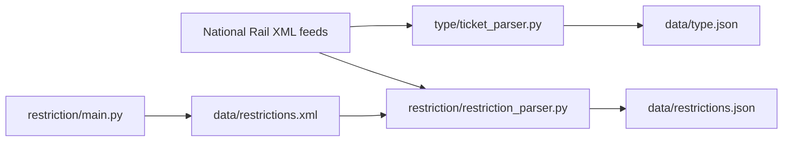

# National Rail-data pipeline

A compact data pipeline for National Rail ticket metadata and restriction feeds.

## Overview

This repository contains two parser workflows that fetch XML feeds, normalize the contents into structured Python models, and generate JSON datasets for downstream use.

## Repository structure

- `type/`
  - `ticket_parser.py` downloads the ticket-type feed, parses it, and writes the JSON export.
  - `ticket_models.py` defines the ticket dataclasses, TOC resolution, and HTML/text cleanup utilities.
- `restriction/`
  - `restriction_parser.py` parses restriction payloads into structured records.
  - `restriction_models.py` contains the restriction models and normalization helpers.
  - `main.py` provides the direct download helper for restriction data.
- `data/`
  - `type.xml` and `type.json` store the ticket-type feed and generated export.
  - `restrictions.xml` and `restrictions.json` store the restriction feed and generated export.

## Quick start

1. Create and activate a virtual environment.
   - `python -m venv .venv`
   - Windows: `.venv\Scripts\activate`
   - macOS/Linux: `source .venv/bin/activate`
2. Install dependencies.
   - `pip install requests`
3. Run the ticket-type pipeline.
   - `python type/ticket_parser.py`
4. Run the restriction pipeline.
   - `python restriction/restriction_parser.py`
5. Optionally run the restriction downloader helper.
   - `python restriction/main.py`

## Workflow

## What each module does

- `type/ticket_parser.py`
  - downloads the ticket-type feed
  - streams the XML into structured ticket objects
  - exports the cleaned result to `data/type.json`

- `type/ticket_models.py`
  - defines the ticket schema
  - resolves TOC names
  - cleans HTML fragments into plain text

- `restriction/restriction_parser.py`
  - parses restriction records
  - normalizes nested details and directions
  - exports the cleaned result to `data/restrictions.json`

- `restriction/restriction_models.py`
  - defines the restriction record structure
  - normalizes empty values and restriction types

- `restriction/main.py`
  - downloads the restriction XML payload into the shared `data/` folder

## Notes

- The parser scripts currently rely on the API token configured inside their code, so keep that updated if authentication changes.
- Output files are stored in the shared `data/` directory to keep raw feeds and generated datasets together.
